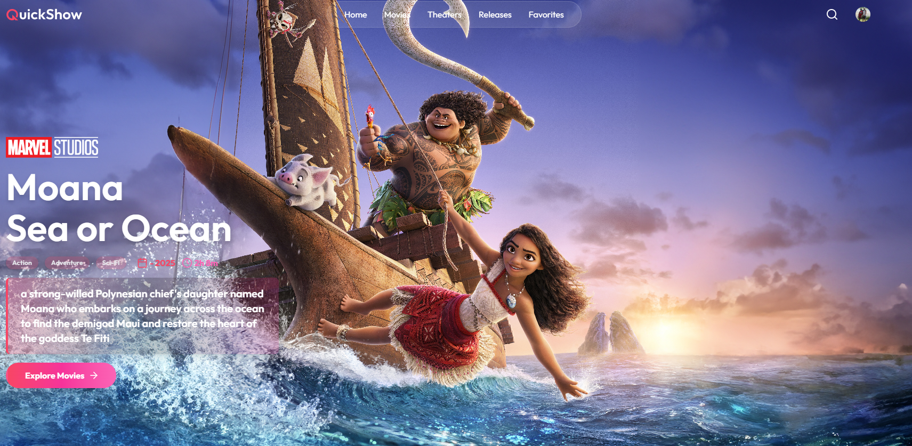

# 🎟️ QuickShow Movie Ticket Booking App

**QuickShow** is a next-generation, full-featured movie ticket booking platform designed for both moviegoers and cinema managers. With a sleek, modern UI and robust admin tools, QuickShow delivers a premium, real-world cinema experience—online.

---
## 🚀 Why QuickShow?

- **Enterprise-Ready:** Built with scalability, security, and maintainability in mind.
- **Stunning UI/UX:** Eye-catching, responsive design powered by React and Tailwind CSS.
- **Admin Dashboard:** Real-time analytics, show management, and booking insights for cinema managers.
- **Developer Friendly:** Modular, well-documented codebase for rapid feature development and easy onboarding.
- **Cloud-Ready:** Easily deployable to Vercel or your favorite cloud provider.

### For Moviegoers

- **Discover Movies:** Browse trending, upcoming, and featured films with immersive visuals.
- **Detailed Movie Pages:** View ratings, genres, cast, trailers, and more.
- **Easy Booking:** Interactive seat selection, real-time availability, and a smooth checkout process.
- **Notifications:** Get instant updates on bookings, show changes, and special offers.

## ✨ Features

- 🎬 **Movie Discovery:** Browse trending, upcoming, and featured movies with rich visuals and details.
- 📝 **Detailed Movie Pages:** Ratings, genres, cast, trailers, and more.
- 🗓️ **Showtimes & Interactive Seat Selection:** Real-time seat availability, intuitive selection, and booking limits.
- 💳 **Secure Booking Flow:** Smooth, multi-step checkout with instant feedback.
- 📊 **Admin Analytics:** Track bookings, revenue, active shows, and user stats in a beautiful dashboard.
- 🛠️ **Show Management:** Add, edit, and schedule shows with flexible pricing and time slots.
- 🔔 **Notifications:** Real-time toast alerts for actions and errors.
- 📱 **Mobile-First:** Fully responsive for all devices.
- 🌐 **Social & Marketing:** Newsletter signup, social media links, and shareable movie pages.

## 🏗️ Tech Stack

- **Frontend:** React, Tailwind CSS, Lucide Icons
- **Routing:** React Router
- **State Management:** React Hooks
- **Notifications:** react-hot-toast
- **Authentication:** Clerk (plug-and-play, can be swapped)
- **Testing:** Jest (recommended for future expansion)
- **Deployment:** Vercel, Netlify, or any static host

## ⚡ Getting Started

1. **Install dependencies:**
   ```bash
   cd client
   npm install
   cd ../server
   npm install
   ```

2. **Run the app:**
   - **Frontend:**  
     ```bash
     cd client
      npm run dev
     ```
   - **Backend:**  
     ```bash
     cd server
      npm run dev
      npm run server
      npm start
     ```
## 🖼️ App Preview
- **Movie TicketApp**  
  
---

## 🛡️ For Managers: What Sets QuickShow Apart?

- **Instant Insights:** See bookings, revenue, and show performance at a glance.
- **Flexible Show Scheduling:** Add, edit, or remove shows with just a few clicks.
- **Custom Pricing:** Set prices per show or seat type to maximize revenue.
- **Audience Analytics:** Understand your customers and tailor your offerings.
- **Easy Staff Onboarding:** Intuitive admin panel means less training, more productivity.
- **Marketing-Ready:** Built-in tools for promotions, newsletters, and social sharing.
- **Secure & Compliant:** Modern authentication and data protection out of the box.
- **Cloud-Ready:** Manage your cinema from anywhere, on any device.

---

**Crafted with ❤️ by MochogeStanley**